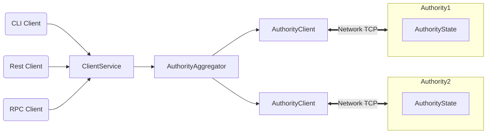

# ma

## Project setup
```
npm install
```

### Compiles and hot-reloads for development
```
npm run serve
```

### Compiles and minifies for production
```
npm run build
```

### Lints and fixes files
```
npm run lint
```

### Customize configuration
See [Configuration Reference](https://cli.vuejs.org/config/).


# Welcome to Sui

[Sui](https://sui.io) is a next-generation smart contract platform with high throughput, low latency, and an asset-oriented programming model powered by the [Move programming language](https://github.com/MystenLabs/awesome-move).

## Sui Highlights

Sui offers the following benefits and capabilities:

 * Unmatched scalability, instant settlement
 * A safe smart contract language accessible to mainstream developers
 * Ability to define rich and composable on-chain assets
 * Better user experience for web3 apps

Sui is the only blockchain today that can scale with the growth of web3 while achieving industry-leading performance, cost, programmability, and usability. As Sui approaches Mainnet launch, it will demonstrate capacity beyond the transaction processing capabilities of established systems – traditional and blockchain alike. Sui is the first internet-scale programmable blockchain platform, a foundational layer for web3.

## Architecture



pported by several cutting-edge [peer-reviewed studies](https://github.com/MystenLabs/sui/blob/main/docs/content/concepts/research-papers.mdx) and extensive years of open-source development.

## More About Sui

Use the following links to learn more about Sui and the Sui ecosystem:

 * Learn more about working with Sui in the [Sui Documentation](https://docs.sui.io/).
 * Join the Sui community on [Sui Discord](https://discord.gg/sui).
 * Find out more about the Sui ecosystem on the [Sui Resources](https://sui.io/resources/) page.
 * Review information about Sui governance, [decentralization](https://suifoundation.org/decentralization), and [Developer Grants Program](https://sui.io/grants-hub) on the [Sui Foundation](https://suifoundation.org/) site.
